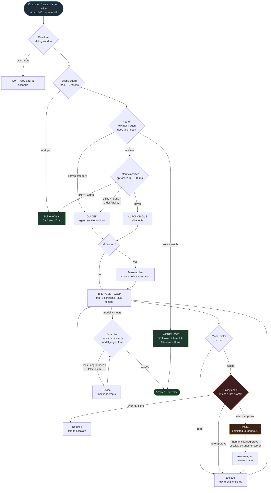
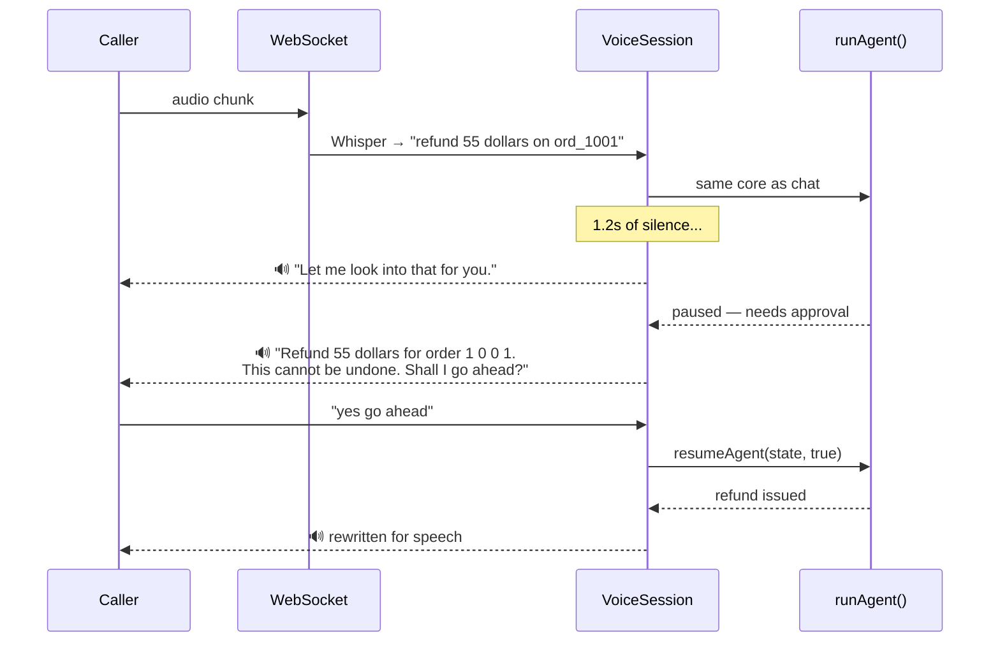

<div align="center">

# HelpDesk Copilot

**A customer support agent that takes actions — and knows when to stop and ask a human.**

[](https://nodejs.org)
[](https://react.dev)
[](https://mongodb.com)
[](https://trychroma.com)
[](https://redis.io)

*Hand-written agent loop. No LangChain, no CrewAI, no `agent.run()`.*

</div>

---

## What this is

A chatbot that returns a wrong answer wastes your time. **An agent that decides wrongly issues a refund, sends an email, or deletes a record.**

Every design decision in this project exists because of that difference.

HelpDesk Copilot handles real support work for an online store — looking up orders, explaining policies from a knowledge base, issuing refunds, applying account credit, changing plans. It decides *how much autonomy each request deserves*, pauses before anything irreversible, checks its own work, and admits what it could not determine.

It runs over **chat** and over **voice**, on the same agent core.

---

## The journey of one request

Here is what actually happens between a customer typing a sentence and getting an answer.



**Three things worth noticing in that diagram:**

1. **Most requests never reach the expensive path.** A workflow answer costs **0 tokens and 12ms**. Measured across 278 real runs, only **9.7%** needed the full autonomous agent.
2. **The pause is a database row, not a suspended function.** You can kill the server between the pause and the approval; the run resumes on a different process.
3. **Policy is enforced in JavaScript, not in the prompt.** A prompt saying "don't refund over $500" is advice. `if (amount > 500) return REFUSE` is a wall.

---

## Autonomy is a gradient, not a switch

The core design idea: **not every ticket needs an agent, and not every action needs a human.**

| Action | Reversible? | Autonomy |
|---|---|---|
| Look up an order | Yes | **Full** — just do it |
| Explain a policy | Yes | **Full** — but cite the document |
| Refund ≤ $100 | Hard | **Auto-approve**, log it |
| Refund $100–$2,000 | Hard | **Ask a human first** |
| Refund > $2,000 | Hard | **Refuse** — escalate |
| Change a plan | Yes | **Ask** — it affects billing |

The line is drawn on **reversibility, not size**. Reading a million rows is safe; moving one dollar is not.

---

## Architecture

```mermaid
flowchart LR
    subgraph CLIENT["Frontend · React 19"]
        CHAT["Chat<br/>live tool activity"]
        TRACE["Trace viewer<br/>every iteration"]
        QUEUE["Operator queue<br/>approve · reject · modify"]
        COST["Cost dashboard<br/>per agent"]
    end

    subgraph API["Backend · Express 5"]
        SSE["/chat/stream · SSE"]
        WS["/voice · WebSocket"]
        REST["/approvals /research<br/>/routing /costs /runs"]
    end

    subgraph CORE["Agent core"]
        RUNNER["agentRunner<br/>hand-written loop"]
        TOOLS["9 tools<br/>registry pattern"]
        POLICY["policy + authorization"]
    end

    subgraph AGENTS["Build 3"]
        COORD["Coordinator"]
        SPEC["Billing · Technical<br/>Account · Research"]
        RESEARCH["Research pipeline"]
        VOICE["Voice session"]
    end

    subgraph DATA["Data"]
        MONGO[("MongoDB<br/>records · runs · approvals")]
        CHROMA[("ChromaDB<br/>12 policy docs")]
        REDIS[("Redis<br/>rate limit · cache")]
    end

    CLIENT --> API
    API --> CORE
    API --> AGENTS
    AGENTS --> CORE
    CORE --> DATA

    style CORE fill:#1e3a2f,stroke:#3fb950,color:#e4e7ec
    style DATA fill:#1e2f3a,stroke:#5b9dff,color:#e4e7ec
```



---

## Tech stack

**Backend** — Node 22 · Express 5 · Mongoose 9 · ws 8
**Frontend** — React 19 · Vite 8 (no component library; the interesting thing on screen should be what the agent is doing)
**Data** — MongoDB 8 · ChromaDB 3 (vector RAG) · Redis 6 (sliding-window rate limiting)
**Models** — Mistral `mistral-small-latest` (reasoning) · Groq `openai/gpt-oss-20b` (intent routing, ~600ms) · Groq `whisper-large-v3-turbo` (speech-to-text) · Web Speech API (speech-out, in-browser, ~50ms to first audio)

**Deliberately not used:** LangChain, CrewAI, AutoGen. The loop, the tool dispatch, the retry logic and the confirmation pause are all hand-written — the assignment requires understanding the machinery, not calling `agent.run()`.

---

## The four things worth reading the code for

### 1. Failure becomes information, never an exception

```javascript
// toolRegistry.js — executeTool NEVER throws
return done(toolError("customer_not_found",
  "No customer account exists for ghost@nowhere.com."), false);
```

The model *reads* that error and recovers — retries with a correction, tries another approach, or explains the problem. A thrown exception ends the conversation; a returned error continues it.

### 2. The pause is resumable from data alone

```javascript
// No closures, no suspended functions, no server-side session
await AgentRun.findOneAndUpdate(
  { runId, status: "awaiting_confirmation" },   // the condition IS the lock
  { status: "resuming", claimedAt: new Date() },
  { returnDocument: "after" }
);
```

Demonstrated: pause on server A → **kill the process** → approve on server B → the agent resumes correctly. Double-clicking Approve returns **409**, not a second refund.

### 3. Reflection: code checks facts, the model judges judgement

| Check | Who runs it | Why |
|---|---|---|
| Internal tool names leaked? | **Code** | It's a fact — a regex is exact and free |
| Numbers grounded in tool results? | **Code** | Comparing to actual values, not vibes |
| Claims an action that never ran? | **Code** | Cross-checked against the trace |
| Tone, relevance, completeness | **Model** | Genuinely needs judgement |

Half the criteria are checked by no model at all. A model asked "is this good?" reports how fluent its own writing felt.

### 4. The research agent says what it could not determine

```
Q: "Are Pro plan customers churning more than last quarter, and why?"

confidence: LOW (0.38) · gaps: 4

"No Pro plan customers were present in the results, so a comparison
 of churn rates between quarters is not possible."
```

Confidence is **computed from evidence**, never asked of the model — a weighted score over coverage (0.45), evidence (0.25), source breadth (0.20), and source health (0.10).

---

## Voice

The same `runAgent()`, with five additions and nothing else.



**A table is a map; speech is directions.** Nobody reads a map aloud:

```
SCREEN   | inv_5001 | ord_1001 | $240.00 | paid |
SPOKEN   "You have three invoices. The most recent is invoice
          5 0 0 3 for order 1 0 0 1 for two hundred forty dollars."
```

**Silence feels like a dropped call.** The filler clock runs from the moment the caller stops talking — not from the longest single step. Progress the customer cannot hear is not progress.

**Barge-in works during the silence**, not only mid-sentence — because that's when people actually interrupt. We stop *speaking*; we do not stop *doing*, since the run may already have moved money.

**Approvals split in two:** the customer can confirm their own refund by saying "yes". A supervisor approval does **not** hold the line — we say what will happen and end the call.

---

## Getting started

**Prerequisites:** Node 20+, Docker, a [Mistral API key](https://console.mistral.ai) (free tier), a [Groq API key](https://console.groq.com) (free)

```bash
git clone https://github.com/Akshay-professor/helpdesk-copilot.git
cd helpdesk-copilot

# 1. Data services
docker run -d --name helpdesk-mongo  -p 27017:27017 mongo:8
docker run -d --name helpdesk-chroma -p 8000:8000   chromadb/chroma
docker run -d --name helpdesk-redis  -p 6379:6379   redis:7-alpine

# 2. Backend
cd backend
npm install
cp .env.example .env        # add your two API keys
node seed-db.js             # load fixture data
node src/server.js          # http://localhost:5000

# 3. Frontend (new terminal)
cd frontend
npm install
npm run dev                 # http://localhost:5173
```

**Try these:**

| Ask | What it demonstrates |
|---|---|
| `where is order ord_1001?` | Workflow route — 0 tokens, 12ms |
| `I'm alice@shop.com — was I charged twice?` | RAG + multi-tool reasoning |
| `refund $55 on ord_1001 for the duplicate charge` | Confirmation pause → Approvals tab |
| `refund $5000 on ord_1001` | Refused in code, not by the model |
| `who is the PM of India?` | Scope guard — 0 tokens |

---

## Testing

24 suites, each demonstrating a **failure path** rather than a happy path.

```bash
cd backend
node seed-db.js         # always reseed first — see below

node test-agent.js         # the loop, tool errors, recovery
node test-safety.js        # policy limits, iteration cap, refusals
node test-authz.js         # cross-customer data access
node test-hitl.js          # pause → restart → approve → resume
node test-reflection.js    # catching a genuinely bad draft
node test-routing.js       # the cheap path stays cheap
node test-multiagent.js    # 32 isolation assertions
node test-research.js      # admitting what it cannot determine
node test-scope.js         # off-topic + prompt injection
node test-voice.js         # needs the server running
```

> **Always `node seed-db.js` before a regression run.** Refunds accumulate across runs, and a correctly capped refund looks exactly like a wrong answer. Two "failures" in this project turned out to be a drifted database rather than broken code.

---

## Measured results

Across **278 real runs**:

| Route | Share | Avg tokens | Avg latency |
|---|---|---|---|
| workflow | 16.9% | **0** | **12ms** |
| guided | 43.2% | 5,286 | 7.5s |
| specialist | 30.2% | 6,543 | 8.4s |
| autonomous | 9.7% | 7,989 | 13.3s |

**Only 9.7% of traffic needs a full autonomous agent.** That number is the entire argument for the routing layer.

### Multi-agent vs single agent — the honest version

Both architectures were benchmarked on the same six request types, three runs each.

| | Correct | Avg tokens |
|---|---|---|
| single agent | 17/18 | **3,938** |
| multi-agent | 18/18 | 5,500 **(+40%)** |

**Multi-agent matched accuracy for 40% more cost** — and only after fixing a flaw it introduced: strict isolation blocked the Account specialist from *reading* invoices, so it failed the cross-domain question **0/3**.

The fix was not to abandon isolation but to place it correctly:

> **Isolate WRITES strictly. Isolate READS loosely.** Blocking a read does not prevent harm — it only prevents answers.

Cross-domain went 0/3 → 3/3, and all 32 isolation assertions still pass.

**Would I ship multi-agent?** For isolation as a security requirement, yes. For quality or speed, no — you get neither and you pay for the privilege. Full analysis in [`docs/multi-agent-analysis.md`](docs/multi-agent-analysis.md).

---

## API

| Endpoint | Purpose |
|---|---|
| `POST /chat` · `POST /chat/stream` | Ask something (SSE streams live tool activity) |
| `POST /chat/confirm` | Resume a paused run |
| `GET /approvals` · `POST /approvals/:runId` | Operator queue — approve, reject, **modify** |
| `POST /research` · `GET /research/:id` | Start an investigation (SSE), reopen a report |
| `GET /routing` · `GET /costs` | Route distribution, per-agent cost |
| `GET /runs` · `GET /runs/:runId` | Full traces |
| `WS /voice` | Voice call — **JWT in the header, never the URL** |

> A URL is not a secret channel: it lands in access logs, proxies, browser history, and Referer headers. **The same secret can be safe in one place and public in another.**

---

## Known limitations

Stated plainly, because a README that only lists strengths is a sales page.

- **No real authentication.** `x-customer-id` is a header anyone can forge. The authorization *layer* is real and enforced on every tool; the identity behind it is not yet verified.
- **Evaluation is thin.** 18 benchmark runs is not an eval suite. Production needs hundreds of cases and drift monitoring.
- **Small fixture dataset.** 3 customers, 6 orders — enough to demonstrate every path, not enough for statistical claims. The research agent correctly reports low confidence because of this.
- **Not deployed.** No CI, no container orchestration, no load testing.
- **Free-tier providers.** Groq's tail latency is unpredictable (p90 ~2.5s); every dependent path degrades gracefully rather than failing.

---

## Project layout

```
backend/src/
├── agent/          loop · planner · reflection · router · classifier · approvals
├── agents/         coordinator + billing/technical/account/research specialists
├── research/       decompose → investigate in parallel → cite → score confidence
├── voice/          STT · speech formatter · session (filler, barge-in) · WebSocket
├── tools/          9 tools; adding one is a registration, not a loop change
├── policy/         limits and ownership, enforced in code
├── rag/            ChromaDB + relevance floor
└── db/             models, persistence, connection

frontend/src/       Chat · TraceViewer · ConfirmModal · OperatorQueue · CostDashboard
docs/               assignment · autonomy policy · multi-agent analysis
```

---

<div align="center">

**Phase 3 — Agent Engineering** · Full-Stack MERN + Agentic AI

*Built by learning what breaks. Every bug in the log was found by using the thing.*

</div>
